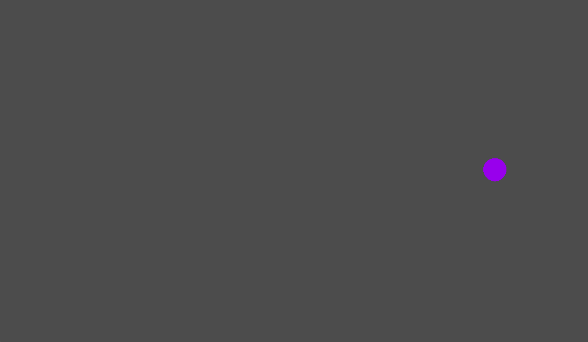
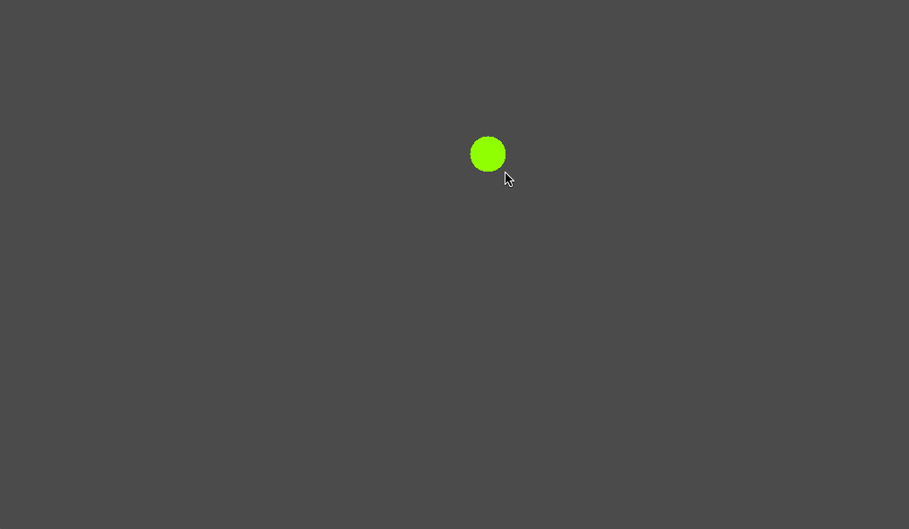
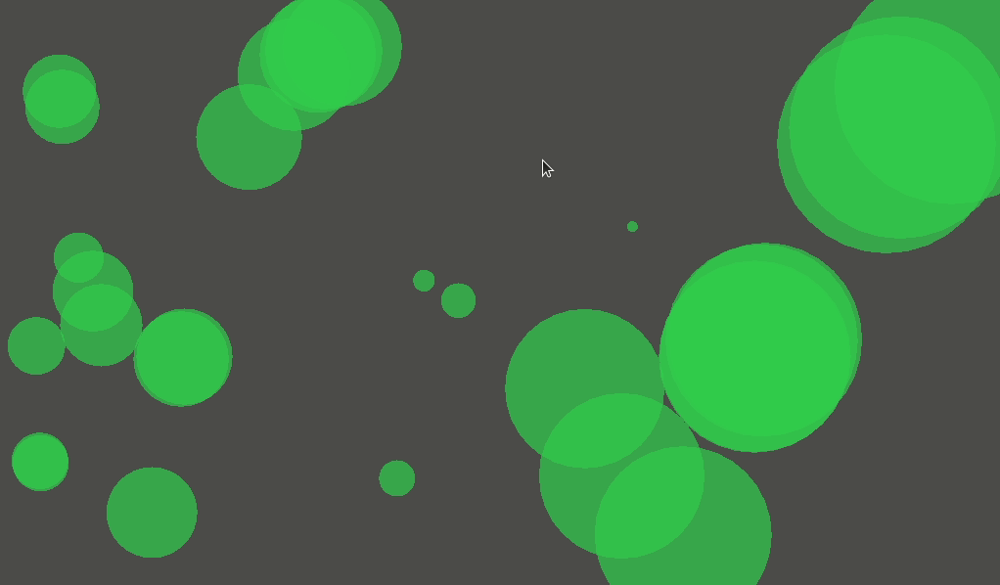

# Just a bouncing ball



# A bouncing ball that follows your mouse



# Bouncing balls influneced by forces



# Let's add friction!


# Translating to Godot style

## Regular balls without friction

Balls as kinematic objects with collision areas. Regular velocity with gravity, no wind, no friction.


## Balls with friction

Add friction to the kinematic objects


## Balls with the bounce function in godot

Add friction, gravity, wind and use the bounce function for vectors on godot.
```
var collide = move_and_collide(velocity)
if collide:
  # The bounce function seems to include some kind of friction
  velocity = velocity.bounce(collide.normal)
  # Use this to avoid the regular bounce friction
  velocity = velocity * collide.normal
```

